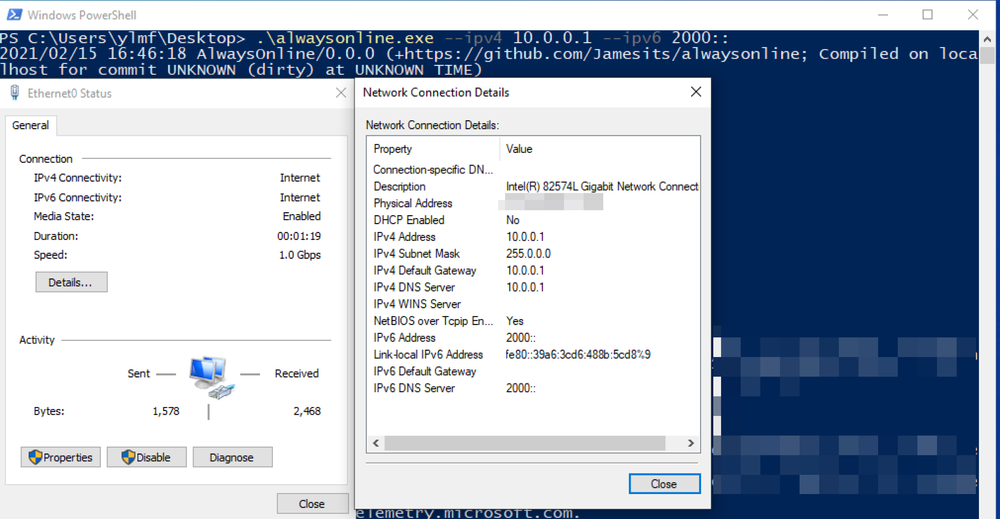

# AlwaysOnline

AlwaysOnline is a HTTP and DNS server which mocks a lot network/internet/portal detection servers. 

[](https://dev.azure.com/nekomimiswitch/General/_build/latest?definitionId=89&branchName=master)

## Usage

Ports required: tcp/80, tcp/53, udp/53.

Start the server:

```shell script
# use docker
docker run \
    -d --restart unless-stopped \
    --cap-drop ALL --cap-add NET_BIND_SERVICE \
    -p 80:80 -p 53:53 -p 53:53/udp \
    jamesits/alwaysonline:latest --ipv4 192.168.1.2 --ipv6 fd00::2

# or download and run the executable
chmod +x ./alwaysonline
setcap cap_net_bind_service=+ep ./alwaysonline
./alwaysonline --ipv4 192.168.1.2 --ipv6 fd00::2
```

(Pass the IP address end users use to connect to the server. See [Which IP Address Should I Use](#which-ip-address-should-i-use) for more information.)

Hijack (delegate) the following domains (including subdomains) on your DNS server to the AlwaysOnline server IP address (and disable DNSSEC verification if possible):

```
// Windows
msftncsi.com
msftconnecttest.com
resolver1.opendns.com (if you use WindowsSpyBlocker to change NCSI config)

// iOS, macOS
captive.apple.com

// Android
clients3.google.com
connectivitycheck.gstatic.com
connectivitycheck.android.com
connect.rom.miui.com
connectivitycheck.platform.hicloud.com

// Linux
network-test.debian.org
nmcheck.gnome.org
www.archlinux.org (DO NOT hijack archlinux.org or other subdomains)
capnet.elementary.io
```

## FAQ / Technical Details

### Why?

Microsoft Store refuses to work when NCSI reports "no Internet", even if it can load everything. Also some UWP games (e.g. ones authorized by Xbox Game Pass) refuse to work without a "Internet". But NCSI is so unreliable in my area that 99% of the time I have the disconnected globe icon on my taskbar. This is why I wrote this piece of software in the first place. 

By terminating portal detection servers in your LAN, you also benefit from:

* Less wait when connecting to a network (mainly on Windows 10)
* Less wired/wireless switching issues on Windows 10
* More privacy (since your ISP and the OS vendor can no longer log these requests)

### Which IP Address Should I Use

Whatever IP addresses you pass to the 2 parameters

* `--ipv4`
* `--ipv6`

will be sent to the client in every DNS response, so that the following HTTP requests will come back to the IP addresses you specified. Generally speaking:

* Use the IP addresses on the public-facing interface of your server
* If the server is behind any destination NAT, reverse proxy or load balancer, use the IP address provided by the NAT/proxy/balancer service
* If you don't have either IPv4 or IPv6 deployed, omit that 

The server will always listen on `0.0.0.0`/`[::]` regardless of the IP addresses you specified.

### Use the HTTP Server without DNS Delegation

It is possible to use only the HTTP server provided by AlwaysOnline. Just make sure you fake every DNS responses right on your own DNS server.

### Security

AlwaysOnline need `cap_net_bind_service=+ep` to listen on ports 53 and 80 as a non-root user. It is recommended to run AlwaysOnline in a confined, readonly environment. 

Exposing AlwaysOnline directly to the internet is not recommended, mainly because DNS/UDP can passively anticipate in an amplification/reflection DDoS attack. AlwaysOnline does not implement any rate limiting or abnormal client blocking mechanism.

### High Availability

AlwaysOnline is stateless, so it is possible to run multiple instances to accommodate your high availability needs. Failover is realized by a 1-second DNS cache TTL and your own DNS server's failover capability. 

I acknowledge this is not the best way to implement HA, but it is simple and enough for casual deployments. If you use AlwaysOnline in a mission-critical environment, then external load balancer with upstream health check (e.g. Nginx or HAProxy) and/or distributed container orchestration tools (e.g. Docker Swarm Mode or Kubernetes) are strongly recommended. 

### Extensibility

AlwaysOnline replies to any URL segments it recognizes, regardless of which domain it comes from. If your client speaks a protocol AlwaysOnline implements but on a different domain, simply add another delegation on your DNS server and everything should work.

### About Windows 10 NCSI Service

Service `NlaSvc` controls NCSI -- Network Connectivity Status Indicator, i.e. the tray icon on your taskbar showing whether you have Internet access. The service, when it goes wrong, is very annoying, as it will cause Microsoft Store to be unusable and all your UWP games unplayable even if you *actually* have Internet access.

NCSI use a set of DNS and HTTP tests to detect if the device is connected to the Internet. The tests can be customized at `HKEY_LOCAL_MACHINE/SYSTEM/CurrentControlSet/Services/NlaSvc/Parameters/Internet`. AlwaysOnline implements the default config. (BTW, Windows 10 CMGE have the same NCSI config as every other Windows 10. )

For a network to trigger the NCSI tests, you need an address, network mask and DNS server to be set. For IPv6 networks, the IP address need to be a global one (in the range `2000::/3`). Sometimes you need a default gateway, but not always. 



NCSI will cache negative results for a network, so if a network is detected to be non-Internet, NCSI will not test it for a long period, even if the network adapter is disabled then re-enabled.

### About Android

Stock Android 7.1.1 or later will connect to both HTTP and HTTPS endpoints for internet detection. AlwaysOnline does not implement the HTTPS server due to obvious reasons. 

If you have privacy concerns, you can change the endpoint URLs manually with ADB. See: https://www.noisyfox.io/android-captive-portal.html
